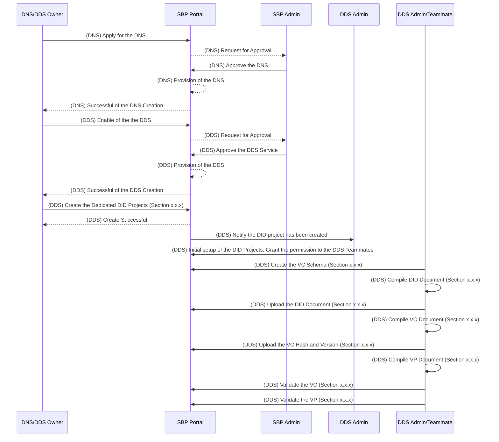

# 零知识证明（ZKP）在 DID & VC/VP 中的应用说明文档


## 现实世界中的例子

假设你去酒吧，保安问你：“你满 18 岁了吗？”

你可以：

-  拿出身份证（暴露了姓名、生日、住址）
-  或者你说：“我能证明我超过 18 岁，但我不想告诉你具体多大年纪”

**零知识证明**就像一个魔术方法，让你只说：“我确实超过 18 岁”，然后让保安**信了你**，而你没有透露任何多余信息！


### 上面例子应该到DID

使用 **ZKP + VP**，达到：

- **选择性披露**：只公开必要字段（如姓名）
- **隐私保护**：隐藏敏感字段（如年龄）
- **可信验证**：通过 ZKP，证明你确实符合某个条件（如年龄 > 18）


### 实现流程

#### 1. 基于gnark设计电路

#### 逻辑含义：

- `Name` 和 `IsOver18` 是 **公开输入**，即 VP 中披露的字段。
- `Age` 和 `Gender` 是 **私有输入**，不会直接暴露。
- 电路中验证的是：`Age > 18`

```go
type CredentialCircuit struct {
	Name    frontend.Variable `gnark:",public"`  // 姓名：公开字段
	Age     frontend.Variable `gnark:",secret"`  // 年龄：隐藏
	Gender  frontend.Variable `gnark:",secret"`  // 性别：隐藏
	IsOver18 frontend.Variable `gnark:",public"` // 结果：公开
}

func (c *CredentialCircuit) Define(api frontend.API) error {
	// 年龄》18
	sub := api.Sub(c.Age, 18)
	end := api.Cmp(sub, 0)
	api.AssertIsEqual(c.IsOver18, end)
	return nil
}
```

- api.Cmp` 返回是否 `Age - 18 >= 0
- 用 `AssertIsEqual` 强制这个逻辑必须成立


### **2. 构造 ZK 证明**

##### 基本流程：

* 编译电路  —>  生成证明密钥、验证密钥 —>  电路输入构造witness  —> 生成证明

```go
// 编译 ZK-SNARK 电路
r1cs, err := frontend.Compile(gecc.BN254.ScalarField(), r1cs.NewBuilder, &circuit)
// 生成证明密钥和验证密钥
pk, vk := groth16.Setup(r1cs)
assignment := CredentialCircuit{
		Name: stringToBigInt(name), // 将 Name/birthDate 作为公开输入填入，此处填占位0
		Age:      age,                    // 隐藏字段
		Gender:   stringToBigInt(gender), // 隐藏字段 ("男" -> 1 编码)
		IsOver18: 1,
	}
// 电路输入	生成 witness
witness, err := frontend.NewWitness(&assignment, gecc.BN254.ScalarField())
// 生成和验证证明
proof := groth16.Prove(r1cs, pk, witness)
```

- 使用 `groth16` 编译电路 → 得到证明密钥、验证密钥
- 构造 witness，其中：
  - Name = "张三"
  - Age = 30
  - Gender = "男"
  - IsOver18 = 1

生成了不泄露 `Age` 和 `Gender` 的 ZK 证明，证明 `Age > 18`。


### 3. 构造 VP（选择性披露）

```go
vp := map[string]interface{}{
				...
				// 零知识证明字段由 gnark 生成，我们此处留空或示例格式
				"proof": map[string]interface{}{
					"type":               "ZKSnarkProof2020",
					"verificationMethod": verMethod.ID.String(),
					"zkProof":            zkProofToBase64(proof),            // 编码后的 ZK 证明
					"publicInput":        publicInputsToBase64(&assignment), // 可选
					//"circuitHash":        fmt.Sprintf("%x", hash),         // VC原字段哈希，用于加密绑定
					"verificationKey": encodeVerificationKeyToBase64(vk), // 嵌入验证密钥
					"proofSystem":     "groth16",
					"curve":           "BN254",
					"hashAlgorithm":   "MiMC",
				},
			},
		},
	}
```

* zkProof：提交证书大于18岁的证明
* publicInput： 允许看到的信息（比如 name、IsOver18）
* verifyingKey：声明验证密钥
* proofSystem`/`curve： 用的是什么证明系统和算法


###  4. 验证 VP（ZK 验证）

* 从vp中的proof中获取信息： 验证公钥 `vk` 和公开输入（`name`, `isOver18=1`）

```go
// 解码 ZK 证明和公共 witness	
proofDecode, err := decodeZKProofFromBase64(zkProofEncoded)
// 解码 ZK 证明 公开输入
publicWitnessDecode, err := decodePublicWitnessFromBase64(publicEncoded, hashEncoded)
// ZK 验证
err = groth16.Verify(proofDecode, vk, publicWitnessDecode)
```


# SBP-DI Overall flow
 
## Legend
| SBP/Tenants | SBP Role | Remarks/   Description |
|----------|----------|----------|
| SBP Support Team | SBP Admin |  
| Tenants | Team Administrator |  
| Tenants | Team Member |  
 
PP: Permissioned Project
 
 
## Flow - Create Acocunt
 
## Flow - Dedicated Node Service   (DNS) and Dedicated DID Service (DDS)
 
### Abbreviations  
| Abbreviations  | Description | Remarks/ Description |
|----------|----------|----------|
| DNS | Dedicated Node Service |  
| DDS | Dedicated DID Service |  
 
 
### Role 
| SBP/Tenants | SBP Role | Remarks/   Description |
|----------|----------|----------|
| SBP Support Team | SBP Admin |  
| Tenants | DNS/DDS Owner |  
| Tenants | DDS Admin |  
| Tenants | DDS Member |  
 


